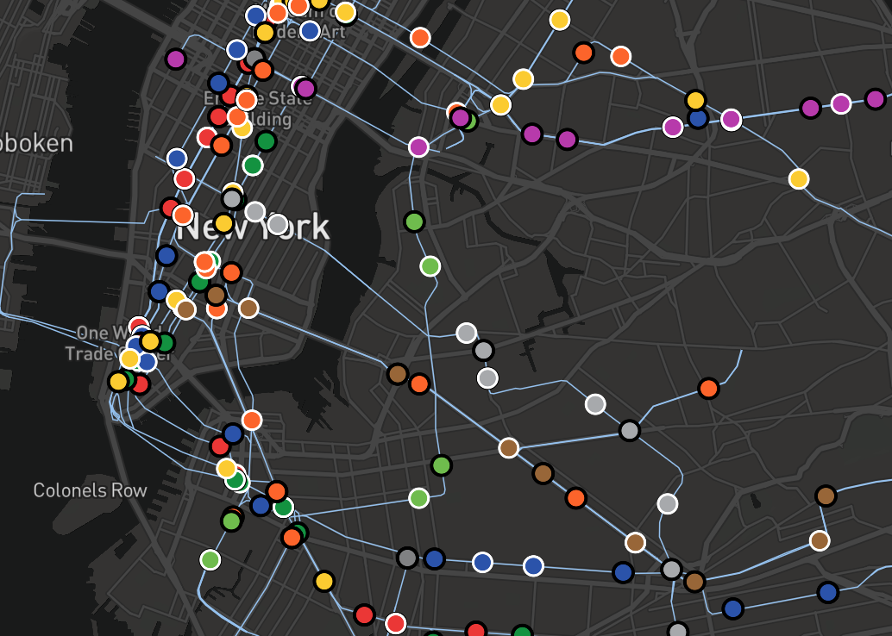

## Where Are The Trains?

A real-time map of the NYC Subway System.

### Backend

The backend API is written in Go and provides a single endpoint.

#### `/live`

Returns a GeoJSON object with the best estimate of the position of every active train in the subway system.

### Development

Run `docker-compose up` to launch the backend and the client in development mode. The client will run on port 3000, and the backend is accessible on port 8080.

### Production

To launch a minified, static production client instead of the default development client, use `docker-compose -f docker-compose-prod.yaml up`.

#### Deployment

For deployment on a public website, the client will need to be modified to request the train position GeoJSON from whatever URL is being used to proxy the backend Docker container.